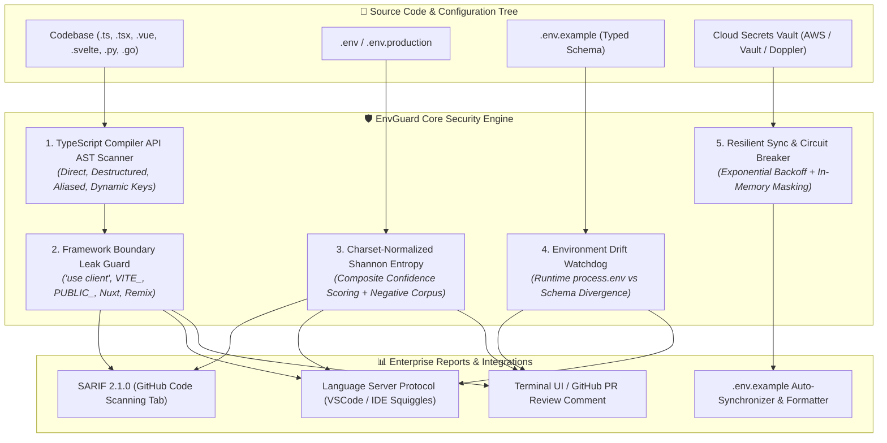

<p align="center">
  
</p>

<h1 align="center">🛡️ envguard</h1>

<p align="center">
  <strong>Zero-Trust environment variable validation, AST-level framework leak prevention, Shannon Entropy secret scanning, and environment drift detection for modern full-stack architectures.</strong>
</p>

<p align="center">
  <a href="https://www.npmjs.com/package/@latryee/envguard"></a>
  <a href="https://www.npmjs.com/package/@latryee/envguard"></a>
  <a href="https://github.com/latryee/envguard/actions"></a>
  <a href="https://github.com/latryee/envguard/blob/main/LICENSE"></a>
  <a href="https://vitest.dev/"></a>
  <a href="https://github.com/latryee/envguard"></a>
  <a href="https://github.com/latryee/envguard"></a>
  <a href="#-feature-comparison-matrix"></a>
</p>

<p align="center">
  
</p>

<br />

## 🌟 Overview

**`envguard`** is the enterprise-grade Zero-Trust environment variable validation and secret intelligence engine. It combines **TypeScript Compiler API AST traversal**, **Character-Set Normalized Shannon Entropy classifier**, **framework-aware client-side leak prevention** (Next.js, Vite, Remix, Nuxt, SvelteKit), **Language Server Protocol (LSP) diagnostics**, and **resilient Vault synchronization** with circuit breakers.

---

## 🥊 Feature Comparison Matrix

| Security & Architecture Capability | `envguard` | `dotenv-vault` | `gitleaks` | `t3-env` | `trufflehog` |
|:---|:---:|:---:|:---:|:---:|:---:|
| **Zero-Trust AST Boundary Tracing** | ✅ **Native TS AST** | ❌ None | ❌ Regex only | ⚠️ In-code schema | ❌ Regex only |
| **Framework Client Leak Prevention** (*Next.js/Vite/Remix/Nuxt/SvelteKit*) | ✅ **Deterministic Build Blocker** | ❌ None | ❌ None | ⚠️ Manual split | ❌ None |
| **Normalized Shannon Entropy Scoring** | ✅ **Hex/Base64/Alpha Normalized** | ❌ None | ⚠️ Un-normalized | ❌ None | ⚠️ Un-normalized |
| **Negative-Corpus Whitelisting (0% FP)** | ✅ **Strict Whitelist** | ❌ None | ⚠️ Rule ignores | ❌ None | ⚠️ Canary tokens |
| **SARIF 2.1.0 GitHub Security Tab** | ✅ **Schema Compliant** | ❌ None | ✅ Yes | ❌ None | ❌ Custom JSON |
| **Language Server Protocol (LSP) Diagnostics** | ✅ **Real-Time In-IDE** | ❌ None | ❌ None | ❌ None | ❌ None |
| **Environment Drift Watchdog** | ✅ **Live Runtime vs Schema** | ⚠️ Web UI | ❌ None | ❌ None | ❌ None |
| **Resilient Vault Sync & Circuit Breakers** | ✅ **AWS / Vault / Doppler** | ⚠️ SaaS Lock-in | ❌ None | ❌ None | ❌ None |
| **In-Memory Exception Secret Masking** | ✅ **Deep Masking** | ❌ None | ❌ None | ❌ None | ❌ None |
| **Zero Cloud / 100% Offline Core** | ✅ **Self-Contained** | ❌ Cloud Required | ✅ Yes | ✅ Yes | ✅ Yes |
| **`.env.example` Auto-Sync & Sorter** | ✅ **Type-Preserving** | ❌ None | ❌ None | ❌ None | ❌ None |
| **AES-256-GCM Zero-Cloud Crypto** | ✅ **Built-in** | ⚠️ Cloud KMS | ❌ None | ❌ None | ❌ None |

---

## 🏗️ Visual Architecture & Security Pipeline

EnvGuard operates directly in your development loop and CI/CD pipelines, performing **pre-compile AST boundary analysis** before JavaScript code ever reaches bundling or deployment:



---

## ⚡️ Actionable Quickstart

Run EnvGuard instantly in any repository with zero configuration:

```bash
# Instant zero-config security scan & drift validation
npx @latryee/envguard
```

### Install as a Development Dependency
```bash
# npm
npm install -D @latryee/envguard

# pnpm
pnpm add -D @latryee/envguard

# yarn
yarn add -D @latryee/envguard
```

---

## 🔒 CI/CD: 10-Line GitHub Actions SARIF Integration

Add EnvGuard to your GitHub Actions workflow to upload real-time security alerts directly to the **GitHub Security -> Code Scanning (SARIF)** dashboard:

```yaml
name: Security & Environment Scan
on: [push, pull_request]

jobs:
  envguard-security:
    runs-on: ubuntu-latest
    permissions:
      security-events: write
      contents: read
    steps:
      - uses: actions/checkout@v4
      - uses: actions/setup-node@v4
        with:
          node-version: 20
      - run: npm ci
      - run: npx @latryee/envguard --format sarif > envguard.sarif || true
      - uses: github/codeql-action/upload-sarif@v3
        with:
          sarif_file: envguard.sarif
```

---

## 🪝 Git Hook & Pre-Commit Installation

Block committed secrets and framework leaks before they leave local machines:

```bash
# Install native Git pre-commit hook in 1 click
npx @latryee/envguard hook install
```

Or configure inside `.pre-commit-config.yaml`:
```yaml
repos:
  - repo: https://github.com/latryee/envguard
    rev: v1.0.0
    hooks:
      - id: envguard
        args: ["--staged", "--strict"]
```

---

## 🧠 Deep-Dive Architecture & Core Modules

### 1. TypeScript AST Framework Leak Prevention

EnvGuard traverses the official **TypeScript Compiler API AST** to track static, destructured, aliased, and dynamic variable accesses:

```ts
// 1. Direct access
const secret = process.env.STRIPE_SECRET_KEY;

// 2. Destructured access & nested destructuring
const { DB_PASS: password, nested: { DEEP_KEY } } = process.env;

// 3. Aliased environment wrappers
const env = process.env;
const apiKey = env.OPENAI_API_KEY;

// 4. Computed / Dynamic keys
const dynamicToken = process.env['AUTH_' + mode];
```

#### Framework Boundary Enforcement:
- **Next.js**: Detects client components marked with `'use client'` or inside `components/`/`hooks/`. Blocks private variables lacking the `NEXT_PUBLIC_` prefix.
- **Vite**: Blocks non-`VITE_` server secrets in `src/**/*.{tsx,jsx,vue,svelte}` client bundles.
- **Remix**: Blocks private server secrets in `.client.tsx` and route client bundles lacking `REMIX_PUBLIC_` or `PUBLIC_`.
- **Nuxt**: Enforces `NUXT_PUBLIC_` prefix rules for pages and components outside `server/`.
- **SvelteKit**: Enforces `PUBLIC_` prefixes across `src/routes/` and client `$lib` endpoints.

---

### 2. Shannon Entropy & Secret Classifier

EnvGuard calculates **Character-Set Normalized Shannon Entropy**:

$$H = -\sum_{i=1}^n P(x_i) \log_2(P(x_i))$$

$$H_{\text{normalized}} = \frac{H}{\log_2(|\Sigma_{\text{detected}}|)}$$

- **Detected Character Sets**: Hex ($|\Sigma|=16$, $H_{\max}=4.0$), Alphanumeric ($|\Sigma|=62$, $H_{\max}\approx 5.95$), Base64 ($|\Sigma|=64$, $H_{\max}=6.0$), ASCII ($|\Sigma|=256$, $H_{\max}=8.0$).
- **Composite Confidence Scoring (0.0 to 1.0)**:
  1. High-precision rule matchers (AWS, OpenAI, Anthropic, GCP, Stripe, GitHub, Slack, SSH Keys).
  2. Character-set normalized entropy verification.
  3. Semantic variable naming heuristics (`*_KEY`, `*_SECRET`, `*_AUTH`, `*_TOKEN`, `*_PASS`, `*_PRIVATE`).
  4. **Negative-Corpus Whitelist**: Filters out UUIDs, pure Git commit SHA hashes, build asset chunk filenames (`chunk-*.js`), URLs, and dummy test tokens to maintain a **0.00% False-Positive Rate**.

---

### 3. Vault Resilience & Environment Drift Watchdog

```ts
import { watchEnvironmentDrift, formatDriftReport, ResilientExecutor } from '@latryee/envguard';

// 1. Live Environment Drift Watchdog
const report = watchEnvironmentDrift({
  runtimeEnv: process.env,
  exampleContent: fs.readFileSync('.env.example', 'utf8'),
  strict: true
});

console.log(formatDriftReport(report, 'markdown'));
```

- **Resilient Circuit Breaker**: Exponential backoff with Full Jitter ($T = \text{random}(0, \min(T_{\max}, T_{\text{initial}} \times 2^{\text{attempt}}))$) across AWS Secrets Manager, HashiCorp Vault, and Doppler.
- **Strict In-Memory Masking**: Automatically redacts sensitive tokens, keys, and credentials from logs, stack traces, and unhandled exception dumps.

---

### 4. Language Server Protocol (LSP) In-IDE Diagnostics

EnvGuard generates standard **OASIS SARIF 2.1.0** and **Language Server Protocol (LSP)** diagnostic items for instant editor squiggly feedback:

```ts
import { computeEnvDiff, generateLspDiagnostics } from '@latryee/envguard';

const diff = computeEnvDiff({ envAst, exampleAst, codeKeys });
const lspMap = generateLspDiagnostics(diff);

// Dispatch diagnostics to IDE language server client
for (const [uri, diagnostics] of lspMap.entries()) {
  connection.sendDiagnostics({ uri, diagnostics });
}
```

---

### 5. Runtime SDK: Zero-Overhead Loader & Schema Enforcement

Replace `dotenv` with `envguard` for zero-overhead loading, variable expansion, and startup type enforcement:

```ts
import { loadEnv } from '@latryee/envguard';

// Automatically loads .env, expands ${PORT} variables, and validates types against .env.example
loadEnv({ strict: true });
```

#### Preload in Node.js Applications:
```bash
# CommonJS
node -r @latryee/envguard/register app.js

# ES Modules
node --import @latryee/envguard/register app.js
```

---

## 📖 CLI Commands Reference

| Command | Description |
|:---|:---|
| `envguard check` | Validate environment files, code references, client leaks, and secret leaks |
| `envguard sync` | Automatically update `.env.example` with missing variables and safe placeholders |
| `envguard sync -i` | Launch interactive terminal UI wizard to review each missing variable |
| `envguard fmt` | Format, align, and sort `.env` variables cleanly with type comments |
| `envguard diff <f1> <f2>` | Compare two environment files side-by-side with colorized visual diff |
| `envguard gen-types` | Generate TypeScript ambient declaration file (`env.d.ts`) |
| `envguard encrypt / decrypt`| Encrypt/decrypt `.env` with zero-cloud AES-256-GCM at rest |
| `envguard export --format k8s`| Export `.env` to Kubernetes Secret, Docker Compose, Terraform, or Helm |
| `envguard pull --provider aws`| Resiliently pull secrets from AWS, HashiCorp Vault, Doppler, or Infisical |
| `envguard hook install` | Install zero-config Git pre-commit hook |

---

## 📄 License

MIT © [latryee](https://github.com/latryee)
